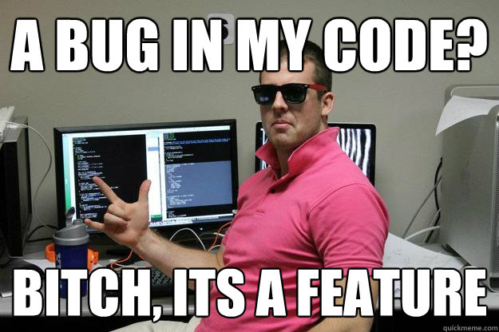

# 👍 Welcome !

    

처음부터 버그는 없었습니다만?

# 🏛 Education

- Multicampus K-digital training  **`Current`**

  - 2022.06 ~ 2022.12

- B.S., Mechanical Engineering, Pusan National University
  - Minor : Electrical Engineering
  - 2014.03 ~ 2022.02

# 💻 My toolbox

                         

# 📊 Stats

