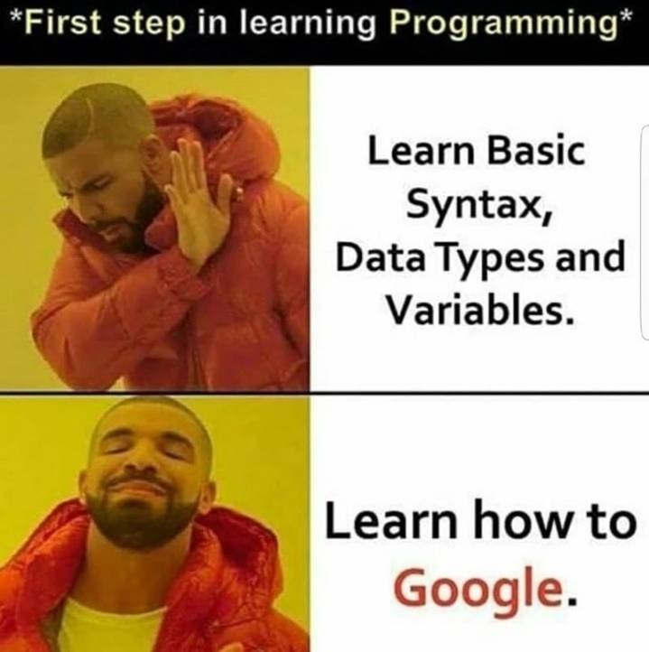

# 👍 Welcome !

    

어떤 문제든 반드시 해결합니다!

# 🏛 Education

- Multicampus K-digital training : Full stack developer  **`Current`**

  - 2022.06 ~ 2022.12

- B.S., Mechanical Engineering, Pusan National University
  - Minor : Electrical Engineering
  - 2014.03 ~ 2022.02

# 📂 Main Repository
- [Project](https://github.com/techtaek54/Project)
  - [Personal Project](https://github.com/techtaek54/Project/tree/master/Personal_Project)
    - [[개인 1차] JSON을 활용한 Python기반 데이터 활용](https://github.com/techtaek54/Project/tree/master/Personal_Project/KDT01_Python_JSON)
    - [[개인 2차] requests library을 활용한 Python기반 데이터 활용](https://github.com/techtaek54/Project/tree/master/Personal_Project/KDT02_Python_API_requests)

- [Algorithm](https://github.com/techtaek54/Algorithm)
  - `codeup` `BOJ` `SWEA` `KDT` 등 다양한 알고리즘 문제 풀이 

- [Multicampus](https://github.com/techtaek54/Multicampus)
  - K-digital 과정 중 TIL 및 관련 내용 

# 💻 My toolbox

# 📊 Stats

